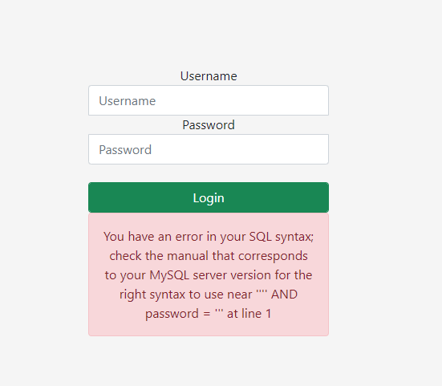
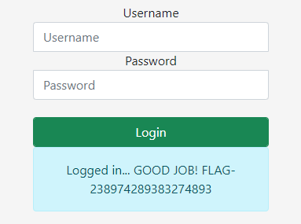

# Most basic SQLi pattern.

## Details

- Username = 3ABC0
- Category = SQL Injection
- Name = Most basic SQLi pattern
- Point = 1
- [Challenge Link](http://challenges.ringzer0team.com:10001/)

## Walk through

### Overview

This is a basic SQL injection vulnerability.  The challenge provides a standard looking web logon form, simply popping `'` into the username field on the form results in:

We get a lovely SQL error message and it even tells us the type of database server we're playing with.

### Solution

The game here is to figure out how to construct a string which will bypass the application controls.

If we assume that under the hood the SQL server is running a query something like:

`SELECT * FROM Users WHERE username = <username> AND password = <password>`

Now we need to provide a password string that results in this form of query returning a valid result set.  This will be of the form of adding an `OR` clause that makes the whole `WHERE` epression return `true`.

After a bit of tinkering and getting the syntax right, a magic string that worked was (in the password field):

`' OR '1'='1`

You can pop whatever you like into the username field (but it cannot be empty).  Result in:

## Summary

Pretty simple one to start with, classic SQLi vuln.  Only trickiness was figuring out where to put the `'` characters.  It's been a while since I've done this.
