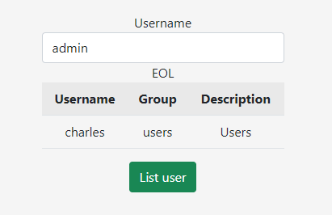
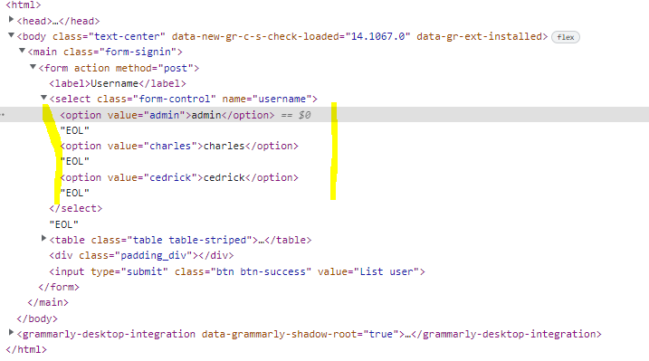
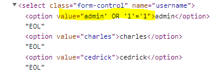
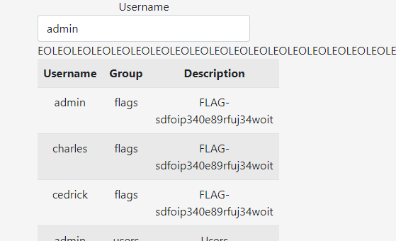

# ACL rulezzz the world.

## Details

- Username = 3ABC0
- Category = SQL Injection
- Name = ACL rulezzz the world.
- Point = 2
- [Challenge Link](http://challenges.ringzer0team.com:10002/)

## Walk through

### Overview

This one provides a web form containing a user dropdown and a submit button.  Choose a user and submit to get a view of the users ACLs.

This time, however we cannot change the items in the dropdown directly - so how do we inject the SQL...?

### Solution

I tackled this one by whacking `F12` in the brower and manipulating the HTML. The availble options for the dropdown are:

Again we can make use of the SQL trick used in [Most basic SQLi pattern](../001%20-%20Most%20basic%20SQLi%20pattern/README.md), specifically:

`' OR '1'='1`

Using Chrome DevTools to edit the HTML like:

Hay presto we get a full listing of all users and their groups - which nicely includes the FLAG.

## Summary

Builds on the first SQLi task, this time slightly more complicated as we need to manipulate the DOM.
